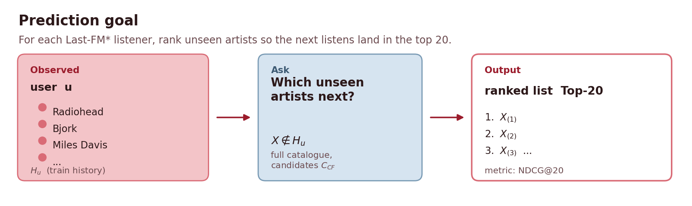
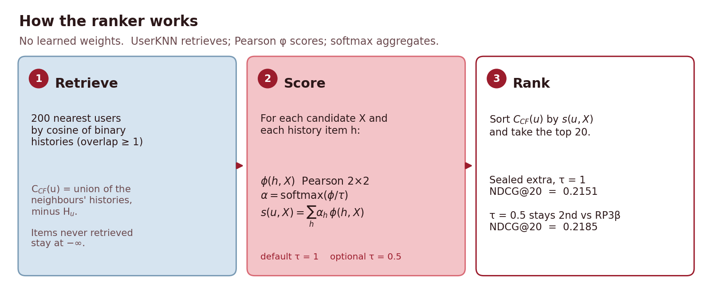
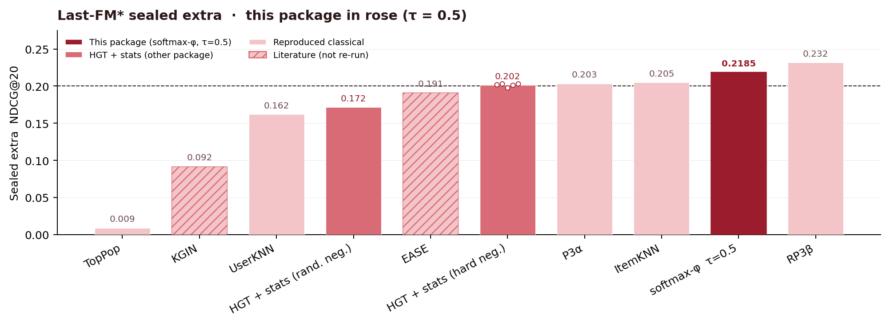

# Last-FM* — softmax-weighted φ ranker (post-competition extra)

<p align="center">
  
</p>

<p align="center">
  
</p>

<p align="center">
  
</p>

Parameter-free follow-up from the thesis. UserKNN (k=200) retrieves
candidates; Pearson φ against the listening history ranks them with a
softmax mean (τ=1 by default). **No learned weights.** τ=0.5 is a
supported sharper setting on this Last-FM* extra: NDCG@20 = 0.2185, still
2nd vs RP3β (~0.232). It does **not** replace the frozen τ=1 number
(0.2151).

On the same sealed extra protocol as HGT + stats this method reported
**NDCG@20 = 0.2151** at τ=1 (n=23_529), above hard-neg HGT + stats (0.2015)
and second to RP3β (~0.232) in the thesis comparison. With ``--tau 0.5``
the extra is **0.2185** and remains 2nd vs RP3β.

This package is **separate** from the HGT + A5 + H3 + LEG repo.

Regenerate the landing figures with `python scripts/make_readme_figures.py`.

## Data

Same Last-FM* files as the joint model:

| Path | Role |
|---|---|
| `data/LastFM_star_IntentAwareRS/` | IntentAwareRS leakage-corrected dump (citation in that folder's `MANIFEST.json`) |
| `data/splits/model_train.txt` | DEV train (not used alone on extra) |
| `data/splits/valid.txt` | folded into TRAIN_EXTERNAL |
| `data/splits/test.txt` | sealed extra labels |
| `SHA256_DATA.json` | fingerprints |

`TRAIN_EXTERNAL = model_train ∪ valid` = 1_235_905 interactions.

## Numbered pipeline

```bash
python3 -m venv .venv && source .venv/bin/activate
pip install -r requirements.txt
python -u pipeline/01_prepare_train_external_from_lastfm_star_splits.py
python -u pipeline/02_evaluate_softmax_weighted_phi_ranker_on_sealed_extra.py
python -u pipeline/02_evaluate_softmax_weighted_phi_ranker_on_sealed_extra.py --tau 0.5
```

| Step | Script | Does |
|---:|---|---|
| 1 | `pipeline/01_prepare_train_external_from_lastfm_star_splits.py` | Union model-train ∪ valid; checks 1_235_905 interactions and 23_529 eval users. |
| 2 | `pipeline/02_evaluate_softmax_weighted_phi_ranker_on_sealed_extra.py` | UserKNN → φ → softmax scores on sealed extra. Writes `verify_rerun/sealed_metrics.json`. |

Each file's docstring is the specification (formulas, gates, outputs).

## What the score is

Take a listener `u` and an unseen artist `X`. Look at every artist `h`
already in that listener's history. For each pair `(h, X)` compute
Pearson phi: how much those two artists co-occur across TRAIN_EXTERNAL
users (listen vs not-listen, same 2×2 table as HCR `a_11`).

Those phi values become softmax weights. The score of `X` is the
weighted sum of phi against the history. Temperature `tau` controls how
peaky the weights are.

The published extra uses `tau = 1` (NDCG@20 = 0.2151). In the code you
can pass `--tau 0.5` (`TAU_SHARP`): more weight on the strongest
history–candidate links. On Last-FM* extra that is 0.2185 and still
second to RP3β. It does not replace the frozen `tau = 1` number.

Artists that UserKNN never retrieved are not scored; they stay at the
bottom of the list.

## Frozen result

See `expected/frozen_sealed_extra.json` (τ=1). After a re-run, compare
`verify_rerun/sealed_metrics.json` — `|Δ|` vs 0.215101 should be ~0
(same splits, no RNG).

`--tau 0.5` is the supported sharper extra (0.2185). It is not the
frozen default.
